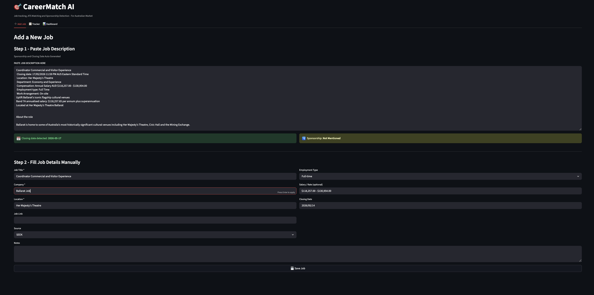
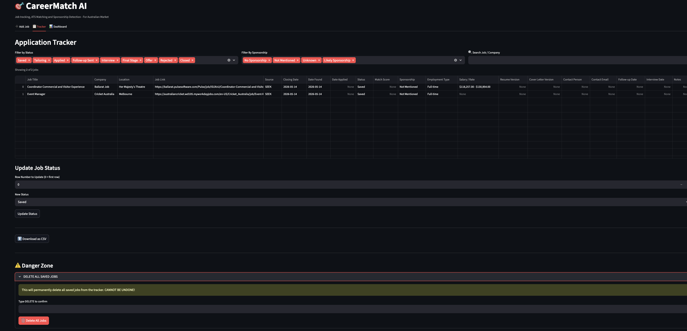
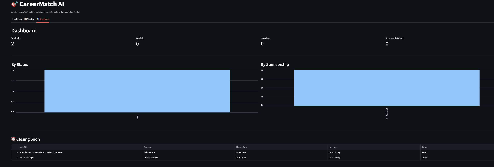

# 🎯 CareerMatch AI

Built for the Australian graduate job market using Python, Streamlit and rule-based NLP.

CareerMatch AI is a Python + Streamlit job application tracker designed to help job seekers manage applications, detect visa sponsorship signals, extract important job details, and monitor progress through an interactive dashboard.

---

## 🚀 Current Features

- Paste a job description and auto-fill key fields
- Extracts:
  - Job title
  - Company
  - Location
  - Salary
  - Employment type
  - Closing date
- Detects visa sponsorship signals for Australian job ads
- Tracks application status across the job search pipeline
- Dashboard with application metrics and closing-soon alerts
- Learner memory system for repeated company detection
- Automated test coverage with `pytest`
- Excel-based local storage

---

## 📸 Screenshots

### Add Job


### Tracker


### Dashboard


---

## 💡 Why I Built This

As an international graduate in Australia, I wanted a practical tool to manage job applications, identify sponsorship-friendly roles, and avoid missing application deadlines.

This project also demonstrates my skills in:
- Python development
- Data handling
- Text processing
- Product thinking
- Git-based development

---

## 🛠 Tech Stack

| Technology | Purpose |
|---|---|
| Python | Core application logic |
| Streamlit | Interactive web interface |
| Pandas | Data handling and analytics |
| openpyxl | Excel-based persistence layer |
| Regex + Rule-Based NLP | Information extraction from job descriptions |
| Git + GitHub | Version control and project management |

---

## 🗺️ Roadmap

| Phase | Description | Status |
|---|---|---|
| Phase 1 | Job tracker, extraction engine, dashboard | 🔄 In Progress |
| Phase 2 | ATS keyword matching | ⏳ Planned |
| Phase 3 | Resume and cover letter tailoring | ⏳ Planned |
| Phase 4 | Job discovery integration | ⏳ Planned |
| Phase 5 | Streamlit Cloud deployment | ⏳ Planned |

---

## ✅ Testing

This project includes automated tests using `pytest`.

### Current test coverage:
- Visa sponsorship detection
- Closing date extraction
- Job title extraction
- Company extraction
- Employment type extraction
- Salary extraction
- Learner memory functions

### Run tests

```bash
python -m pytest -v
```

---

## 🚧 Current Status

CareerMatch AI is currently in active Phase 1 development.

The current focus is:
- Reliable rule-based extraction
- Stable application tracking
- Clean testing workflow
- Learning memory system

Future phases will introduce ATS matching, resume tailoring, and job discovery integration.

---

## ⚙️ Setup

```bash
git clone https://github.com/chakravarthiw/careermatch-ai.git

cd careermatch-ai

python3 -m venv venv

source venv/bin/activate

pip install -r requirements.txt

streamlit run app.py
```

---

## 📁 Project Structure

```text
careermatch-ai/
├── app.py
├── requirements.txt
├── README.md
├── .gitignore
│
├── src/
│   ├── tracker.py
│   ├── utils.py
│   └── learner.py
│
├── tests/
│   ├── test_utils.py
│   └── test_learner.py
│
├── data/        # Local tracker files ignored by Git
└── docs/        # Screenshots and documentation
```

---